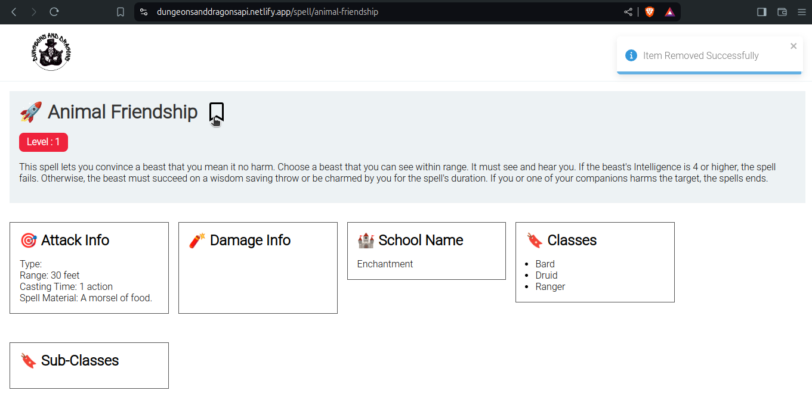

# Dungeons And Dragons

## Introduction

Dungeons and dragons is a project that lists all the spells available, check their details and either add or remove them from favourites.

## System Requirements

1. Docker and Docker Compose
2. Make

## Github Branches

There are two main branches in this project.

1. main
2. dev

The **main** branch contains production ready code.
The **dev** branch contains developmental codes.

## Links

1. **Github**: https://github.com/sunilkkhadka/Dungeons-and-Dragons
2. **Live Site**: https://dungeonsanddragonsapi.netlify.app/

## Installation

1. Clone the project from github.

```
git@github.com:sunilkkhadka/Dungeons-and-Dragons.git
```

2. Checkout to `dev` branch and run the following docker command.

```
sudo docker compose up -d
```

3. If you want to run the project locally, you can run the following command.

```
npm run local:dev
```

4. Finally, copy and paste the following URL on your browser.

```
// if running project on docker
http://localhost:5173

// if running project local
http://localhost:5000
```

## Packages used in the project

1. React - Core library
2. React DOM - To connect react with the browser
3. Typescript - For type definitions
4. Redux Toolkit - For state management
5. React Icons - For icons
6. React Toastify - For displaying toast messages on certain actions
7. React Router - For routing
8. Eslint Airbnb - To enforce airbnb react code standards

## Folder Structure


1. **app**: This folder contains redux store. The contents of this folder is used in conjunction with **features** folder, following the convention specified by redux toolkit.
2. **features**: Contans files that define state slices for specific features. Each feature has its own slice file.
3. **components** : Contains files that describe a part of the UI.
4. **hooks**: Contains custom hooks
5. **layouts**: Contains reusable layouts. These layouts are used to compose larger components.
6. **routes**: Contains route definition.
7. **styles**: Contains **.scss** files.
8. **types**: Contains type definiton and dummy data for javascript codes.
9. **utils**: Contains utilities such as loading environment variables or icons.
10. **views**: Contains combination of multiple components that takes the shape of a web page.

## Project Walkthrough

### Home Page


This is the home page of the website. To the top-right, you have links to the list page which is the current page and your favourite spells page. The names are hyperlinks to spell details page.

### Spell Details Page


This page has the details of the spell. You can bookmark the current spell by clicking on the bookmark icon right beside the name of the spell.

If you bookmark a spell, you will get a toast message notification



### Favourites Page


This page basically contains the list of spells that you added to your favourites. If you click on any of the link from the table, you will be redirected back to the spells details page.
